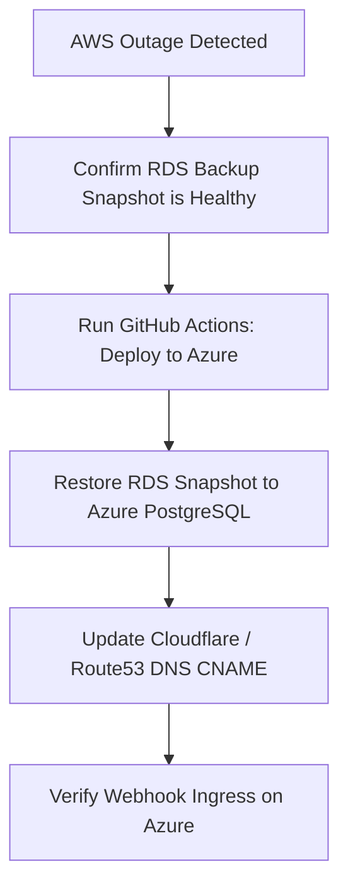

# Failover Runbook & Cost Comparison: AWS vs. Azure

This document details the operational failover runbook and provides a comparative cost analysis between the AWS and Azure deployments for the Enterprise Integration Deployment Platform.

---

## 1. Cloud Provider Cost Comparison (INR)

The following tables present a monthly cost estimation for equivalent production-scale environments (handling ~5,000 transactions/hour) running on both AWS and Azure. All figures are converted to Indian Rupees (INR) at an exchange rate of 1 USD = ₹83.

### 1.1. AWS Production Monthly Estimate

| Service | Instance / Size Details | Quantity | Monthly Cost (INR) | Notes |
|---|---|---|---|---|
| **ECS Fargate** | 0.25 vCPU / 0.5 GB RAM | 2 tasks | ₹1,800 | Container hosts |
| **RDS PostgreSQL** | `db.t4g.small` (Multi-AZ, 30 GB SSD) | 1 instance | ₹11,000 | HA database |
| **Application Load Balancer** | LCU + Base charge | 1 ALB | ₹2,200 | Traffic routing |
| **NAT Gateway** | Base charge + Data processed | 1 Gateway | ₹4,000 | Outbound legacy API polls |
| **AWS Secrets Manager** | Per secret + API requests | - | ₹500 | Credential vault |
| **Total AWS Cost** | | | **₹19,500 INR** | **₹2.34 Lakhs / Year** |

### 1.2. Azure Production Monthly Estimate

| Service | Instance / Size Details | Quantity | Monthly Cost (INR) | Notes |
|---|---|---|---|---|
| **Azure Container Apps** | 0.25 vCPU / 0.5 GiB RAM | 2 replicas | ₹1,500 | Container hosts (incl. free grant) |
| **Azure PostgreSQL Flex** | `Standard_B2s` (Zone-Redundant, 32 GB) | 1 instance | ₹12,000 | HA database |
| **Container Ingress** | Built-in (Env level) | - | Free | No separate LB fee |
| **Virtual Network NAT** | Base charge + Data processed | 1 Gateway | ₹0 | Direct Azure route tables |
| **Azure Key Vault** | Per secret + API operations | - | ₹200 | Credential vault |
| **Total Azure Cost** | | | **₹13,700 INR** | **₹1.64 Lakhs / Year** |

> [!TIP]
> **Key Cost Differentiator**
> Azure Container Apps is **~30% cheaper** than AWS ECS Fargate for this workload because Azure includes a generous free tier of vCPU/Memory allocations and provides built-in ingress routing for free, eliminating the need to pay for a standalone Load Balancer or NAT Gateway.

---

## 2. Failover Runbook: AWS (Primary) to Azure (Secondary)

This runbook outlines the steps to perform a manual failover when the primary AWS region/infrastructure experiences a critical, prolonged outage.

### 2.1. Failover Workflow Sequence



### 2.2. Detailed Execution Steps

#### Step 1: Ingestion Monitoring Alert
*   **Indicator**: Streamlit dashboard displays "Down" or "Degraded" status for pull syncs, or CloudWatch triggers an alarm for `integration-platform-alb` request drops.
*   **Verification**: Run a manual curl request to check server status:
    ```bash
    curl -I http://YOUR-AWS-ALB-DNS-NAME.amazonaws.com/api/sources
    # If connection times out or returns 502/503, proceed to Step 2
    ```

#### Step 2: Trigger Azure Infrastructure Deployment
*   Since the infrastructure is abstracted using Terraform, we deploy to our secondary provider (Azure) using GitHub Actions:
    1. Open the GitHub repository.
    2. Go to **Actions** -> select the **Multicloud Integration Platform CI/CD** workflow.
    3. Click **Run workflow** -> select the branch `main`.
    4. Set the **Target Cloud Provider** dropdown to `azure`.
    5. Click **Run workflow** (this will build the Azure VNet, Flexible Server, and Container App).

#### Step 3: Database Data Migration
*   To restore the state:
    *   **Cold Standby**: Restore the latest daily RDS backup snapshot to the Azure PostgreSQL Flexible Server instance.
    *   **Warm Standby**: If active-passive replication is running, verify that the replica database status is up-to-date and cut off the sync stream to promote Azure to Master.

#### Step 4: Route DNS Failover
*   Update your global DNS resolver (e.g. Cloudflare / AWS Route 53) to shift traffic:
    1. Locate the DNS CNAME record for `api.integration-global.com`.
    2. Change the target value from the AWS Load Balancer URL:
       `integration-platform-alb.us-east-1.elb.amazonaws.com`
    3. To the Azure Container App FQDN:
       `integration-engine-app.eastus.azurecontainerapps.io`
    4. Set the TTL to 60 seconds to ensure instant propagation.

#### Step 5: Verify Active Ingest & Dashboard
*   Access the secondary Streamlit dashboard on port `8502` pointing to the Azure API.
*   Click **⚡ Fire Mock Webhook** in the sidebar.
*   Verify that the record is successfully parsed and saved into the Azure database, and check that the status returns to "Healthy".
