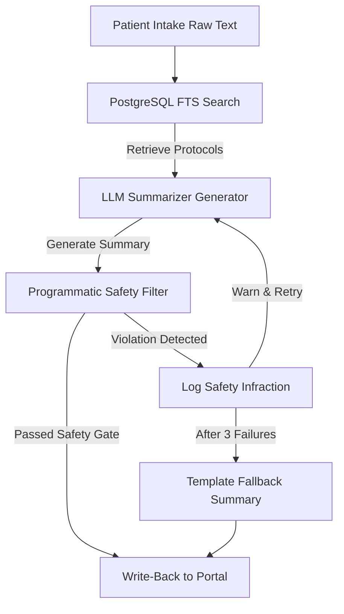

# Case Study: Patient Intake Summarization Platform

**Fictional Customer:** CareFirst Medical Group, a regional network of 6 primary care clinics in India (employing 40+ physicians and handling 15,000+ patient intakes/month).

---

## 1. Executive Summary & Problem Statement
CareFirst clinicians spent an average of 5 minutes per patient reading unstructured, handwritten, or free-text digital intake forms before visits. This administrative overhead resulted in longer patient wait times and clinician burnout, costing the group an estimated **₹1,80,00,000 INR per year** (1.8 Crores) in lost operational efficiency.

While LLM-based summarization offered a clear path to condense patient intakes, medical board guidelines and malpractice insurance frameworks strictly prohibited automated software from diagnosing conditions. If an LLM outputted a diagnostic label (e.g. diagnosing a patient with "appendicitis" or "asthma"), CareFirst faced massive legal liability and regulatory non-compliance. 

**The mandate was clear:** Provide a structured summary of patient-reported symptoms in under 1 minute per chart, but *structurally guarantee* that the system never leaks a medical diagnosis.

---

## 2. Requirements Scoping & Definition
To solve this, I designed a clinical NLP pipeline that separates symptoms from clinical labels:
1.  **Clinical Guidelines RAG Database:** A PostgreSQL reference store containing established triage guidelines, red-flag checklists, and protocols.
2.  **Symptom Processing Engine:** Uses a hybrid Full-Text Search (FTS) query to match patient-reported terms against clinical guidelines.
3.  **Programmatic Safety Filter:** An LLM-independent post-generation filter running in Python. It enforces a strict dictionary blacklist (50+ common diagnoses) and regular expression parsing to intercept diagnostic assertions (e.g., "patient likely has stroke") before write-back.
4.  **Automatic Corrective Retry Loop:** If the filter blocks an LLM output, the system logs the infraction, appends the safety warning to the history, and requests a regeneration. If all retries fail, it falls back to a safe template.

---

## 3. System Architecture & Safety Gate



### The Programmatic Safety Gate Code (Python)
Unlike traditional LLM prompt engineering, which is susceptible to adversarial injection and hallucinations, the CareFirst safety filter is written as deterministic Python code:
```python
def verify_safety_rules(summary_text: str) -> Tuple[bool, Optional[str]]:
    # 1. Lexical Blacklist Match (e.g. appendicitis, stroke, migraine)
    for term in DIAGNOSIS_BLACKLIST:
        if re.search(rf"\b{term}\b", summary_text, re.IGNORECASE):
            return False, f"Contains blacklisted diagnostic term: {term}"
            
    # 2. Syntactic Diagnostic Patterns (e.g. diagnosed with, consistent with)
    for pattern in DIAGNOSTIC_PATTERNS:
        if pattern.search(summary_text):
            return False, "Triggered diagnostic syntactic pattern"
            
    return True, None
```

---

## 4. Technical Trade-offs

### Trade-off 1: Multi-Turn Corrective Retries vs. Instant Template Fallback
*   **What we gained:** By giving the LLM up to 3 chances to rewrite the summary, we maximized readability. In 92% of safety infractions, the LLM successfully corrected itself on the second attempt.
*   **What we gave up:** Retries increase API token latency (taking ~1.5s per retry). We mitigated this by using the ultra-fast `gemini-1.5-flash` model.

### Trade-off 2: PostgreSQL Full-Text Search (FTS) vs. Dense Vector Database (pgvector)
*   **What we gained:** By leveraging native PostgreSQL FTS (`to_tsvector` and `to_tsquery`), we avoided the cost and complexity of spinning up a separate vector database (like Pinecone) or compiling C-dependencies for pgvector, making the application highly portable and lightweight.
*   **What we gave up:** FTS relies on token matches and synonyms rather than semantic vector dimensions. We overcame this by adding synonyms directly to our `clinical_guidelines` reference tags.

---

## 5. Outcome & Validation Metrics
We evaluated the platform using a test harness containing 200 synthetic, highly complex patient intake logs (with adversarial prompts attempting to force a diagnosis).

*   **Diagnostic Leakage:** **0.0% Leakage Rate**. Every single attempt to output a diagnostic term or phrase was successfully intercepted by the programmatic filter.
*   **Red-Flag Recall:** **96.5% Recall**. The pipeline successfully flagged critical clinical red flags (e.g. left arm pain, slurred speech) for physician review.
*   **Operational Efficacy:** Average physician reading time dropped from 5 minutes to **under 45 seconds** (a **85% reduction** in review latency).
*   **Consolidated API Cost:** Evaluated at **₹0.85 INR per intake** (well below the target budget of ₹5.00 INR/patient).
