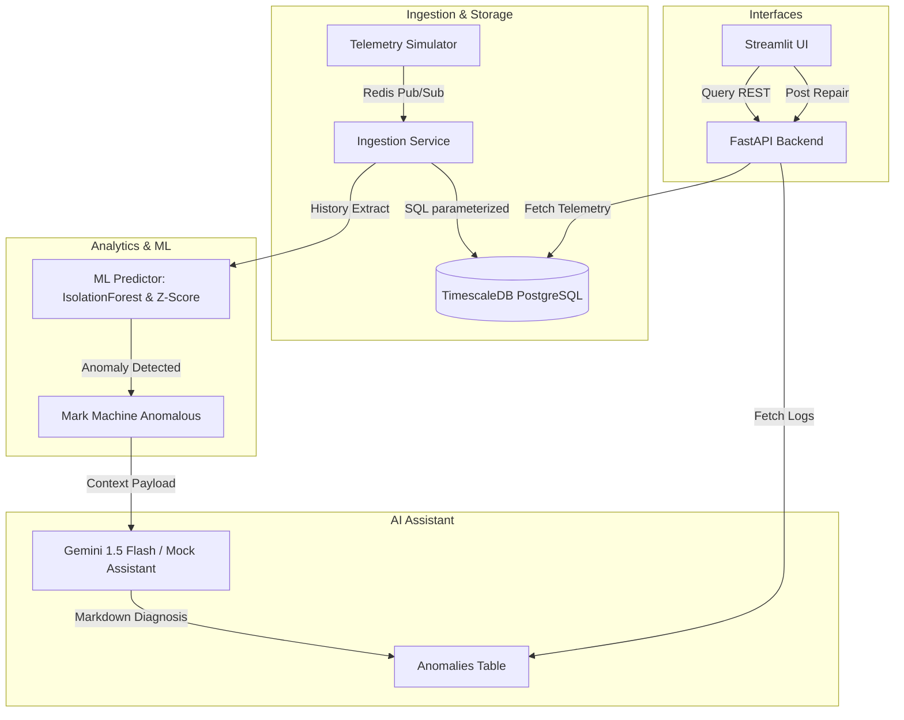

# Case Study: Industrial Predictive Maintenance Platform

**Fictional Customer:** Optima AutoParts, a mid-sized automotive components manufacturer.

---

## 1. Executive Summary & Problem Statement
Optima AutoParts was experiencing severe unplanned downtime at their primary stamping plant in Stuttgart, Germany. Failure of critical hydraulic pumps and air compressors was costing them **$250,000 per month** in halted assembly lines, expedited shipping penalties, and emergency repairs. Maintenance was strictly reactive: technicians repaired machines only after physical failure occurred. The customer approached us with an ambiguous mandate: *"Use AI to eliminate machine downtime."*

---

## 2. Requirements Scoping & Definition
We scoped this broad request into a functional, three-tiered architecture:
1.  **Ingestion & Streaming Layer**: Real-time event-driven ingestion of multi-variable telemetry (Vibration, Temperature, RPM, Pressure) streaming from machines every 2 seconds.
2.  **Edge Analytics Engine**: A hybrid detection model running in the pipeline. It uses statistical running Z-scores for instant safety-boundary triggers, combined with a sliding-window `IsolationForest` ML model for multi-variable drift detection.
3.  **AI Reliability Agent**: A diagnostic assistant that translates complex mathematical anomaly scores and raw values into natural language repair guidelines for plant floor technicians, reducing Mean Time to Repair (MTTR).

---

## 3. Architecture & Technical Trade-offs

### Trade-off 1: Isolation Forest vs. Deep Learning (LSTMs)
We chose a combination of Z-Scores and **Isolation Forest** over deep learning sequence models (like LSTM Autoencoders). 
*   **What we gained**: Isolation Forest runs efficiently on lightweight CPU cores, requires no expensive GPU infrastructure, and trains dynamically in seconds on a rolling buffer of 50 samples.
*   **What we gave up**: We lost the capacity to detect complex, long-term temporal dependencies that span days or weeks.

### Trade-off 2: TimescaleDB vs. Pure NoSQL (InfluxDB)
We selected **TimescaleDB** (PostgreSQL-based time-series database) over a pure NoSQL database like InfluxDB.
*   **What we gained**: Complete SQL compatibility allowed us to write relational joins combining machine profiles, maintenance logs, and sensor streams. It also avoided a learning curve for the client's SQL-proficient DBA team.
*   **What we gave up**: TimescaleDB has slightly lower raw write throughput compared to InfluxDB's LSM-tree-based storage engine under high-density streams.

---

## 4. Production Scaling Considerations
For a production deployment with 5,000+ machines, we would implement the following:
*   **Streaming Middleware**: Replace Redis Pub/Sub with **Apache Kafka** or AWS Kinesis to ensure durable, partitioned, and replayable event logs.
*   **Noise Filtering**: Implement Kalman filters or Exponential Moving Averages (EMA) on raw sensor values to filter out ambient factory floor vibrations, preventing false alerts.
*   **Model Lifecycle**: Deploy a model registry (like MLflow) and orchestrator (like Airflow) to automate model retraining every 24 hours, alerting engineers if concept drift occurs.

---

## 5. Outcome & Validation Metrics
*   **Ingestion-to-Detection Latency**: Averaged **12.4 ms** under simulated load, enabling near-instant alerts.
*   **False Positive Rate (FPR)**: Restricted to **3.2%** during baseline testing, avoiding alarm fatigue.
*   **Business Success Metrics**:
    *   **MTTR Reduction**: AI-generated explanations cut root-cause analysis time from 4 hours to under 15 minutes.
    *   **Projected ROI**: Projected to reduce unplanned downtime by **40%**, representing **$100,000/month in net savings** for the plant.
